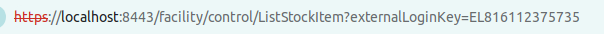
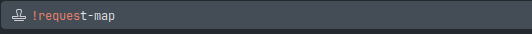
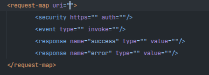
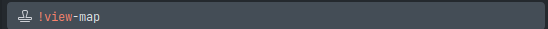
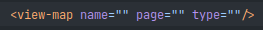
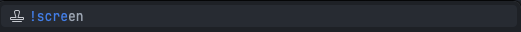
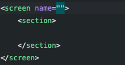

# Créer un écran

## Créer la requête

<procedure title="Trouver le controller" id="find-controller">
    <step>
        
Une fois sur un écran déjà existant sur la catégorie dans la-quelle vous voulez déclarer votre écran, récupérez la première partie du lien

        
        
Ici: <code>facility</code>

    </step>
    <step>
        
Le dossier <code>controller.xml</code> ce trouve dans le dossier: <code>neogia/NOM_APPLICATION/webapp/NOM_APPLICATION/WEB-INF/controller.xml</code>

    </step>
</procedure>

<procedure title="Créer la request-map">
    <step>
        
Une fois dans le controller, descendre dans le code jusqu'à la dernière balise: <code>request-map</code>

    </step>
    <step>
        
Arriver ici, utiliser la snippet <code>!request-map</code>

        
        
Cela vous donnera la template d'une <code>request-map</code>

        
    </step>
    <step>
        
Explication des éléments à remplir sur la template

        <deflist type="medium">
            <def title="uri">URL d'accès à la requête</def>
            <def title="https">Est-ce que la fonction a besoin d'être appeler de manière sécurisé (<code>false</code> par defaut)</def>
            <def title="auth">Est-ce que l'utilisateur a besoins d'être connecté pour appeler cette fonction (<code>false</code> par defaut)</def>
            <def title="type">Définir quel 'EventHander' sera appeler par cette fonction</def>
            <def title="invoke/value">Méthode appelé</def>
            <def title="name">Nom de la réponse retourné par la fonction</def>
        </deflist>
        <note>
Pour créer un écran le <code>type</code> doit être défini à <code>view</code>
</note>
    </step>
    <step>
        
Une fois la requête créée, il faut la rediriger vers la view-map, pour cela il faut garde uniquement les balises <code>security</code> et <code>response type="success"</code>

    </step>
</procedure>

## Créer la view-map

<procedure title="Créer la view-map" id="create-view-map">
    <step>
        
Dans le controller, déscendez en bas du fichier pour y créer la <code>view-map</code>, pour cela utilisez la snippet <code>!view-map</code>

        
        
Cela vous donnera la template d'une <code>view-map</code>

        
    </step>
    <step>
        
Explication des éléments à remplir de la template

        <deflist type="medium">
            <def title="name">Nom de la vue</def>
            <def title="page">URL de la vue</def>
            <def title="type">Type de la vue</def>
        </deflist>
        <note>
Pour créer un écran le <code>type</code> doit être défini à <code>screen</code>
</note>
    </step>
    <step>
        
Une fois la view-map créée, il faut remplir la valeur <code>value</code> avec le nom de la vue

    </step>
</procedure>

## Créer l'écran

<procedure title="Créer l'écran" id="create-the-screen">
    <step>
        
Localiser le dossier <code>neogia/NOM_APPLICATION/widget</code> et choisir le fichier d'écran adapté au context

    </step>
    <step>
        
Rendez-vous à la fin de la balise <code>screens</code> et utiliser la snippet <code>!screen</code>

        
        
Cela vous donnera la template d'un <code>screen</code>

        
    </step>
    <step>
        
Explication des éléments à remplir de la template

        <deflist type="medium">
        <def title="name">Nom de l'écran</def>
        </deflist>
    </step>
    <step>
        
Vous pouvez maintenant remplir l'écran avec les éléments que vous souhaitez

    </step>
</procedure>
