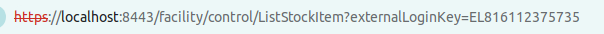
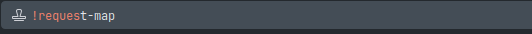
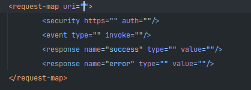
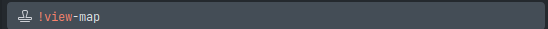
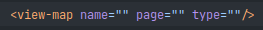

# Créer un écran

## Créer la requête

<procedure title="Trouver le controller" id="find-controller">
    <step>
        
Une fois sur un écran déjà existant sur la catégorie dans la-quelle vous voulez déclarer votre écran, récupérez la première partie du lien

        
        
Ici: <code>facility</code>

    </step>
    <step>
        
Le dossier <code>controller.xml</code> ce trouve dans le dossier: <code>neogia/NOM_APPLICATION/webapp/NOM_APPLICATION/WEB-INF/controller.xml</code>

    </step>
</procedure>

<procedure title="Créer la request-map">
    <step>
        
Une fois dans le controller, descendre dans le code jusqu'à la dernière balise: <code>request-map</code>

    </step>
    <step>
        
Arriver ici, utiliser la snippet <code>!request-map</code>

        
        
Cela vous donnera la template d'une request map

        
    </step>
    <step>
        
Explication des éléments à remplir sur la template

        <list type="bullet">
        <li>
           
<code>uri</code> : URL d'accès à la requête

        </li>
        <li>
           
<code>https</code> : Est-ce que la fonction a besoin d'être appeler de manière sécurisé (<code>false</code> par defaut)

        </li>
        <li>
           
<code>auth</code> : Est-ce que l'utilisateur a besoins d'être connecté pour appeler cette fonction (<code>false</code> par defaut)

        </li>
        <li>
           
<code>type</code> : Définir quel 'EventHander' sera appeler par cette fonction

        </li>
        <li>
           
<code>invoke/value</code> : Méthode appelé

        </li>
        <li>
           
<code>name</code> : Nom de la réponse retourné par la fonction

        </li>
        </list>
        <note>
Pour créer un écran le <code>type</code> doit être défini à <code>view</code>
</note>
    </step>
    <step>
        
Une fois la requête créée, il faut la rediriger vers la view-map, pour cela il faut garde uniquement les balises <code>security</code> et <code>response type="success"</code>

    </step>
</procedure>

## Créer la view-map

<procedure title="Créer la view-map" id="create-view-map">
    <step>
        
Dans le controller, déscendez en bas du fichier pour y créer la <code>view-map</code>, pour cela utilisez la snippet <code>!view-map</code>

        
        
Cela vous donnera la template d'une view map

        
    </step>
    <step>
        
Explication des éléments à remplir de la template

        <list>
            <li>
               
<code>name</code> : Nom de la vue

            </li>
            <li>
               
<code>page</code> : URL de la vue
 
            </li>
            <li>
               
<code>type</code> : Type de la vue

            </li>
        </list>
        <note>
Pour créer un écran le <code>type</code> doit être défini à <code>screen</code>
</note>
    </step>
    <step>
        
Une fois la view-map créée, il faut remplir la valeur <code>value</code> avec le nom de la vue

    </step>
</procedure>

