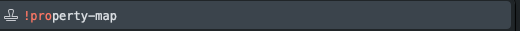
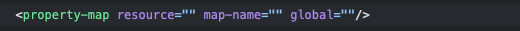
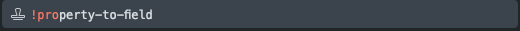
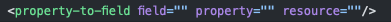

# Comment remplir un écran

## Les sections

Les balises <code>section</code> sont les séparateurs de l'écran elles permettent d'avoir des <code>actions</code> et des <code>widgets</code> différents sur le même écran

## L'élement actions

### Les actions de label

<deflist type="medium">
    <def title="property-map">
        Défini des labels utilisables dans l'écran sous forme de map
    </def>
    <def title="property-to-field">
        Défini la valeur d'un champ depuis un fichier de configuration
    </def>
</deflist>

<procedure title="Utiliser les property-map">
    <step>
        
À l'interieur de votre balise <code>actions</code> utiliser la snippet <code>!property-map</code>

        
        
Cela vous donnera la template d'une <code>property-map</code>

        
    </step>
        <step>
            
Explication des éléments à remplir sur la template

            <deflist type="medium">
                <def title="resource">Nom du fichier contenant les labels</def>
                <def title="map-name">Nom du champ utilisable sur l'écran</def>
                <def title="global">Utilisable sur tout l'écran ?</def>
            </deflist>
        </step>
</procedure>

<procedure title="Utiliser les property-to-field">
    <step>
        
À l'interieur de votre balise <code>actions</code> utiliser la snippet <code>!property-to-field</code>

        
        
Cela vous donnera la template d'une <code>property-to-field</code>

        
    </step>
        <step>
            
Explication des éléments à remplir sur la template

            <deflist type="medium">
                <def title="field">Nom du champ à définir</def>
                <def title="property">Nom de la porpriété de configuration</def>
                <def title="resource">Lien vers le fichier de configuration</def>
            </deflist>
        </step>
</procedure>